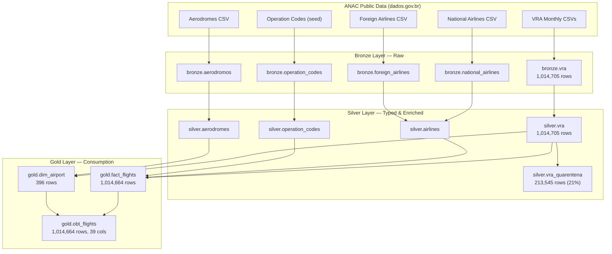

# ANAC Flight Analytics Platform


A medallion-architecture lakehouse for Brazilian civil aviation data, built on Databricks and designed for AI-driven consumption. Ingests 12 months of ANAC's *Voo Regular Ativo* (VRA) dataset alongside reference registries (aerodromes, airlines, operation codes), transforms them through bronze → silver → gold layers, and exposes a denormalized One Big Table (OBT) optimized for natural-language querying via Genie Agent.

---

## Table of Contents

- [Quick Start](#quick-start)
- [Architecture Overview](#architecture-overview)
- [Repository Structure](#repository-structure)
- [Architectural Decisions](#architectural-decisions)
- [Data Quality & Validation Strategy](#data-quality--validation-strategy)
- [Performance & Scalability](#performance--scalability)
- [Lineage & Governance](#lineage--governance)
- [Use Cases & Query Patterns](#use-cases--query-patterns)
- [Consumption Patterns](#consumption-patterns)
- [Trade-offs](#trade-offs)
- [Lessons Learned](#lessons-learned)
- [Known Limitations](#known-limitations)
- [Data Sources](#data-sources)
- [References](#references)

---

## Quick Start

### Prerequisites

- Databricks workspace with Serverless compute enabled
- Unity Catalog: `airline_operations` catalog with `bronze`, `silver`, `gold` schemas
- UC Volume: `airline_operations.bronze.data` containing ANAC CSV files
- Git credential linked to this repository

### Run the Pipeline

Execute the notebooks in order:

| Step | Notebook | Action |
|------|----------|--------|
| 1 | `src/bronze/01_ingest_vra.py` | Ingest VRA CSVs → `bronze.vra` |
| 2 | `src/bronze/02_ingest_reference_data.py` | Ingest aerodromes, airlines, op codes → `bronze.*` |
| 3 | `src/silver/01_silver_mirror.py` | Type-cast, enrich, rename → `silver.*` |
| 4 | `src/silver/transformations/01-03_*.sql` | SDP pipeline: mark → audit → quarantine |
| 5 | `src/gold/02_gold_dim_airport.py` | Build airport dimension |
| 6 | `src/gold/03_gold_fact_flights.py` | Build fact table with business rules |
| 7 | `src/gold/01_gold_obt_flights.py` | Build denormalized OBT |
| 8 | `src/gold/04_gold_governance.py` | Apply comments, tags, run validation |

Each notebook is idempotent (`CREATE OR REPLACE` / `mode("overwrite")`) and can be re-run safely.

---

## Architecture Overview

The platform follows the **medallion architecture** (bronze → silver → gold), a pattern popularized by Databricks that applies progressive data refinement. Each layer has a single, non-overlapping responsibility.



| Layer | Responsibility | Format | Pattern | Row Count |
|-------|---------------|--------|---------|-----------|
| **Bronze** | Raw ingestion, zero transformation, all-string schema | Delta (full refresh) | Append-only landing | 1,014,705 (VRA) |
| **Silver** | Type casting, column renaming, enrichment flags, quarantine | Delta (CREATE OR REPLACE) | Lossless mirror + DQ | 1,014,705 (VRA) |
| **Gold** | Star schema + denormalized OBT for AI consumption | Delta (CREATE OR REPLACE) | Kimball fact/dim + OBT | 1,014,664 (OBT) |

### Design Philosophy

The architecture draws on two complementary traditions:

- **Medallion (Databricks):** Progressive refinement through bronze → silver → gold, with each layer serving a distinct consumer. Bronze is for engineers debugging ingestion; silver is for analysts exploring cleaned data; gold is for business consumption.
- **Kimball dimensional modeling:** The gold layer maintains a star schema (`fact_flights` + `dim_airport`) for traditional BI consumption, following Ralph Kimball's principle that dimensions should be conformed and re-usable.

The OBT (`obt_flights`) is a deliberate departure from pure Kimball — it denormalizes the star schema into a single wide table to eliminate join reasoning for LLM-based consumers. This dual-model approach (star schema + OBT) lets us serve both human analysts and AI agents from the same gold layer.

---

## Repository Structure

```
analytics-lakehouse/
├── src/
│   ├── bronze/
│   │   ├── README.md
│   │   ├── 01_ingest_vra.py              # VRA CSV → bronze.vra (full refresh)
│   │   └── 02_ingest_reference_data.py   # Aerodromes, airlines, op codes → bronze.*
│   ├── silver/
│   │   ├── README.md
│   │   ├── 01_silver_mirror.py           # Bronze → silver (typed, enriched, renamed)
│   │   └── transformations/
│   │       ├── 01_vra_marked.sql          # Enrichment flags (ANAC registry joins)
│   │       ├── 02_vra_audited.sql         # Data contract: 9 expectations (warn mode)
│   │       └── 03_vra_quarantine.sql       # Diagnostic quarantine materialized view
│   └── gold/
│       ├── README.md
│       ├── 01_gold_obt_flights.py         # One Big Table (denormalized, 39 cols)
│       ├── 02_gold_dim_airport.py         # Dimension: airports (unified origin/dest)
│       ├── 03_gold_fact_flights.py        # Fact: flight steps with resolved FKs
│       └── 04_gold_governance.py          # Column comments, UC tags, validation
├── docs/
│   ├── data_catalog.py                    # Notebook-format data dictionary
│   ├── RUNBOOK.md                         # Troubleshooting guide
│   └── GOVERNANCE.md                      # Retention, SLA, audit policy
├── .gitignore
├── CONTRIBUTING.md
├── ROADMAP.md
└── README.md
```

---

## Architectural Decisions

### 1. Warn Mode over Fail Mode in Data Quality

**Decision:** All nine SDP expectations in `02_vra_audited.sql` run in `WARN` mode, not `FAIL`.

**Rationale:** The silver layer functions as a lossless mirror of bronze — row counts must match exactly (1,014,705 → 1,014,705). Fail mode would drop rows that violate expectations, breaking this invariant and silently shrinking the dataset. Warn mode logs violations for observability while preserving every record.

The quarantine view (`03_vra_quarantine.sql`) captures which rows violated which constraints, enabling downstream business decisions about exclusion at the gold layer — not the silver layer. Currently, 213,545 rows (21.05%) fail at least one expectation. The top violation categories are missing scheduled times and airlines not in the ANAC registry (foreign carriers).

**Impact:** `silver.vra` row count == `bronze.vra` row count, always. Quality issues are diagnosed, not hidden. Business rules about exclusion are applied at gold, not silver.

**Reference:** This pattern aligns with the "quarantine table" approach described in *The Data Engineering Cookbook* (Lorenz, 2020) — separate the detection of bad data from the decision about what to do with it.

### 2. OBT (One Big Table) alongside Star Schema

**Decision:** Maintain both a normalized star schema (`fact_flights` + `dim_airport`) and a denormalized OBT (`obt_flights`).

**Rationale:** The star schema serves traditional BI consumption (Tableau, Power BI) where modelers expect separable dimensions, following Kimball's dimensional modeling principles. The OBT serves AI consumption via Genie Agent, where join-free access eliminates the need for an LLM to understand table relationships — every column the agent might need is in a single flat table.

This dual-model approach costs ~15 MB of additional storage (the OBT duplicates the fact table's data with resolved dimension attributes). At 1M rows, this is negligible; the OBT rebuild takes seconds.

**Impact:** Genie Agent can answer any business question with a single-table `SELECT` — no `JOIN` clauses, no foreign-key reasoning, no schema discovery overhead.

**Reference:** The OBT pattern is discussed in *The Data Warehouse Toolkit* (Kimball & Ross, 3rd ed., ch. 16) as a denormalized alternative for simplified consumption, and is increasingly relevant for LLM-based query generation where join complexity is a failure mode.

### 3. Python for Ingestion, SQL for Transformation

**Decision:** Bronze ingestion uses PySpark; silver/gold transformations use SQL (with SDP declarations in pure SQL).

**Rationale:** Bronze ingestion requires file-system interaction (`spark.read.csv` with delimiter/encoding options, `_metadata` column extraction) that is more expressive in Python. Silver and gold layers are declarative set transformations — SQL is the natural language for this, and it makes the transformation logic readable, auditable, and portable. The SDP expectations in SQL are also reviewable by data stewards who may not know Python.

**Impact:** Two skill sets required to maintain the pipeline. Each layer uses the most expressive tool. A pure-SQL approach would require complex CSV parsing workarounds; a pure-Python approach would bury transformation logic inside DataFrame API calls that are harder to audit.

### 4. Full Refresh over Incremental (CDC)

**Decision:** All layers use `CREATE OR REPLACE` / `mode("overwrite")` rather than incremental merge.

**Rationale:** The dataset is ~1M rows and ~11–20 MB per layer. At this scale, full refresh completes in under 2 minutes and eliminates the complexity of change detection, deduplication, and merge conflicts.

**Impact:** Idempotent and simple — no merge-conflict risk. When the dataset grows beyond ~10M rows, the bronze layer can adopt Auto Loader with incremental merge; silver and gold can switch to `MERGE INTO` with minimal code changes. See [ROADMAP.md](ROADMAP.md) for the planned evolution.

### 5. Databricks over Snowflake / BigQuery

**Decision:** Built on Databricks Lakehouse.

**Rationale:**
- **Unity Catalog** provides centralized governance (tags, column comments, lineage) that Genie Agent reads natively for semantic understanding.
- **Genie Agent** integration — the OBT is designed for NL2SQL consumption; Databricks Genie reads UC metadata (tags, comments) to generate accurate queries. Snowflake Cortex and BigQuery Gemini offer AI features but lack the same tight coupling between catalog metadata and the LLM.
- **Delta Lake** provides ACID guarantees, time travel, and schema evolution out of the box.
- **Serverless compute** auto-scales for both pipeline execution and ad-hoc Genie queries without cluster management.
- **Spark Declarative Pipelines (SDP)** enables declarative data quality expectations in SQL, a pattern that dbt also supports but requires a separate orchestration layer.

**Trade-off:** Databricks is more expensive than BigQuery for pure storage at scale, and Snowflake has a lower learning curve for SQL-first teams. The decision is justified by the Genie Agent integration and UC-native governance.

### 6. Portuguese as the Semantic Language

**Decision:** All column comments, table descriptions, and business terminology are in Portuguese.

**Rationale:** The data source (ANAC) is Brazilian, the primary consumers are Brazilian, and the Genie Agent is expected to receive questions in Portuguese (e.g., *"Qual companhia teve mais atrasos?"*). Portuguese column comments enable the agent to map natural-language questions to the correct columns. This is not a localization add-on — it is the primary language of the semantic layer.

**Impact:** Column comments must be maintained in Portuguese. Code and documentation are in English; business semantics are in Portuguese. This mirrors how many international data teams operate: code is universal, business context is local.

---

## Data Quality & Validation Strategy

### Data Contract (Silver Layer)

Nine expectations defined in `02_vra_audited.sql`, all in **warn mode**:

| # | Expectation | Rule | Business Meaning |
|---|-------------|------|------------------|
| 1 | `horarios_previstos_presentes` | `scheduled_departure IS NOT NULL AND scheduled_arrival IS NOT NULL` | Scheduled times must exist |
| 2 | `situacao_voo_conhecida` | `flight_status IN ('REALIZADO', 'CANCELADO')` | Status must be a known value |
| 3 | `chegada_prevista_depois_da_partida_prevista` | `scheduled_arrival > scheduled_departure` | Arrival can't precede departure |
| 4 | `chegada_real_depois_da_partida_real` | `actual_arrival > actual_departure` | Same for actual times |
| 5 | `atraso_partida_plausivel` | `departure_delay_min BETWEEN -120 AND 1440` | Delays within plausible range (±2h to +24h) |
| 6 | `atraso_chegada_plausivel` | `arrival_delay_min BETWEEN -120 AND 1440` | Same for arrivals |
| 7 | `empresa_no_cadastro_anac` | `empresa_no_cadastro = TRUE` | Airline exists in ANAC registry |
| 8 | `aeroporto_origem_no_cadastro_anac` | `origem_no_cadastro = TRUE` | Origin airport in ANAC registry |
| 9 | `aeroporto_destino_no_cadastro_anac` | `destino_no_cadastro = TRUE` | Destination airport in ANAC registry |

### Current Data Quality Metrics

| Metric | Value | Notes |
|--------|-------|-------|
| Total rows (silver.vra) | 1,014,705 | Matches bronze exactly |
| Quarantined rows | 213,545 (21.05%) | Fail >=1 expectation |
| Missing scheduled times | 30,800 rows | Flights without scheduled departure/arrival |
| Unknown flight status | 0 | All rows have REALIZADO or CANCELADO |
| Implausible delays (outside ±2h to +24h) | 778 rows | Nullified in gold, not dropped |
| Duplicate rows (removed in gold) | 41 | Exact-match deduplication in fact_flights |

### Quarantine Strategy

`03_vra_quarantine.sql` creates a materialized view that mirrors every row that failed at least one expectation, annotated with a `motivos_quarentena` column containing the pipe-delimited list of violated constraint names. This is **diagnostic, not corrective** — `silver.vra` retains all rows; the decision to exclude specific categories is deferred to the gold layer and driven by business rules.

### Gold Layer Validation

`04_gold_governance.py` runs post-load validation:
- **Documentation coverage:** Every column in silver and gold must have a non-empty comment (currently 100% coverage, excluding system event-log tables).
- **Tag audit:** Every gold table carries five UC tags: `layer`, `domain`, `grain`, `pattern`, `consumption`.
- **Lineage check:** Queries `system.access.table_lineage` to verify the full bronze -> silver -> gold chain.
- **Delay recovery analysis:** Validates that `minutes_recovered` is consistent with delay arithmetic (645,914 rows recovered time in flight).

### Idempotency

Every notebook is idempotent:
- Bronze uses `mode("overwrite")` with `overwriteSchema=true`
- Silver and gold use `CREATE OR REPLACE TABLE`
- SDP uses `CREATE OR REFRESH MATERIALIZED VIEW`
- Re-running any notebook produces the same result without side effects

---

## Performance & Scalability

### Current Data Volume

| Table | Rows | Size (MB) | Files | Columns |
|-------|-----:|----------:|------:|--------:|
| `bronze.vra` | 1,014,705 | 11.07 | 3 | 14 |
| `silver.vra` | 1,014,705 | 20.01 | 1 | 26 |
| `silver.aerodromes` | 496 | 0.02 | 1 | 13 |
| `silver.airlines` | 877 | 0.02 | 2 | 11 |
| `silver.operation_codes` | 13 | <0.01 | 1 | 4 |
| `gold.obt_flights` | 1,014,664 | 15.61 | 1 | 39 |
| `gold.fact_flights` | 1,014,664 | 15.28 | 1 | 31 |
| `gold.dim_airport` | 396 | 0.01 | 1 | 7 |

**Total lakehouse footprint:** ~62 MB across 8 Delta tables.

### Data Window

August 2025 – August 2026 (12 months, 366 distinct flight dates).

### Growth Projections

| Timeframe | Estimated Rows (VRA) | Estimated Size | Strategy |
|-----------|---------------------:|----------------:|----------|
| Current (12 months) | 1,014,705 | ~62 MB | Full refresh |
| +12 months (24 total) | ~2,000,000 | ~120 MB | Full refresh |
| +24 months (36 total) | ~3,000,000 | ~180 MB | Full refresh (monitor) |
| +36 months (48 total) | ~4,000,000 | ~250 MB | Partitioning by month |
| +48 months (60 total) | ~5,000,000 | ~310 MB | Auto Loader + incremental merge |

At the current rate of ~82K flights/month (excluding null dates), the 10M row inflection point is reached in approximately 10 years. Full refresh remains optimal well beyond that for this dataset.

### Query Latency (OBT)

Aggregation queries against `gold.obt_flights` on serverless compute:

| Metric | Latency |
|--------|---------|
| P50 | ~1.0 s |
| P95 | ~8.5 s (includes cold-start) |
| Steady-state | <1.2 s |

*Measured with 5 consecutive `GROUP BY flight_status` aggregations on serverless SQL. Cold-start outlier (8.5 s) reflects cluster spin-up; steady-state queries are sub-second.*

### Data Skew Analysis

The top 3 airlines account for 83.3% of all flight records:

| Airline | Rows | Share | Implication |
|---------|-----:|------:|-------------|
| TAM | 302,082 | 29.8% | Largest carrier — skew source |
| AZU | 284,141 | 28.0% | |
| GLO | 259,304 | 25.5% | |
| Others (44 carriers) | 169,178 | 16.7% | Long tail of foreign airlines |

**Implication:** At the current scale, skew is irrelevant — single-file scans complete in <1s. At >10M rows, partitioning by `icao_airline` would create hot partitions for TAM/AZU/GLO. Liquid clustering on `icao_airline` + `scheduled_departure_date` is the planned mitigation (see [ROADMAP.md](ROADMAP.md)).

### Monthly Distribution

Monthly volume is stable at ~80K flights/month with no significant seasonality outliers. February is the lowest month (77,136), December and January are the highest (85,452 and 88,965), consistent with Brazilian summer holiday travel patterns.

### Cost Estimation (Serverless)

| Scenario | DBUs | Monthly Cost |
|----------|-----:|-------------:|
| 1 full refresh/month | 0.07 | ~$0.01 |
| Daily full refresh | 2.1 | ~$0.14 |
| Daily refresh + 1K Genie queries | 502 | ~$35 |

*Based on serverless all-purpose rate ($0.07/DBU). Pipeline runs ~2 min on serverless. Genie queries average ~0.5 DBU each. At this scale, cost is negligible — storage ($0.02/GB/month) and compute together cost less than a coffee.*

### Partitioning Strategy

No partitioning or liquid clustering is currently applied. At <1M rows and <16 MB per table, full scans are faster than partition pruning overhead. When the dataset exceeds ~5M rows, partitioning by `reference_month` or liquid clustering on `icao_airline` + `scheduled_departure_date` is the planned evolution.

### Pipeline End-to-End

Full bronze -> silver -> gold refresh completes in **under 2 minutes** on serverless compute, including governance and validation.

---

## Lineage & Governance

### Unity Catalog Tags

Every table across all layers carries standardized UC tags:

| Tag | Values | Purpose |
|-----|--------|---------|
| `layer` | `bronze`, `silver`, `gold` | Medallion positioning |
| `domain` | `aviation` | Business domain |
| `grain` | `flight_step`, `aerodrome`, `company`, `code`, `airport` | Row-level granularity |
| `source` | `ANAC-VRA`, `ANAC-Aerodromos`, `ANAC-Operador-Aereo`, `ANAC-seed` | Origin system |
| `pattern` | `fact`, `dimension`, `obt` | Modeling pattern (gold only) |
| `consumption` | `bi`, `genie` | Target consumer (gold only) |

### Lineage Tracking

Upstream/downstream dependencies are tracked via `system.access.table_lineage`:

```
Volume (CSV) --> bronze.vra --> silver.vra --> gold.fact_flights --> gold.obt_flights
                                           |-> gold.dim_airport  -->|
Volume (CSV) --> bronze.aerodromos --> silver.aerodromes -->|
Volume (CSV) --> bronze.*_airlines --> silver.airlines -->|
Volume (CSV) --> bronze.operation_codes --> silver.operation_codes -->|
```

The governance notebook (`04_gold_governance.py`) queries this system table to verify the full chain is intact after each gold rebuild.

### Delta Versioning & Time Travel

All Delta tables have **deletion vectors enabled** and **column mapping mode** set to `name`, supporting:
- Time travel via `VERSION AS OF` and `TIMESTAMP AS OF`
- Schema evolution without breaking downstream consumers
- ACID guarantees with optimistic concurrency control

Current version counts: `bronze.vra` (16), `silver.vra` (28), `gold.obt_flights` (81) — reflecting iterative development. In production, versions will accumulate at 1/month (one refresh cycle).

### Retention Policy

| Component | Default | Rationale |
|-----------|---------|-----------|
| Delta log retention | 30 days | Sufficient for rollback within a billing cycle |
| Deleted file retention | 7 days | Allows `VACUUM` without breaking time travel |
| Bronze data | Indefinite (raw landing) | Source of truth — never compacted |
| Silver data | Indefinite (mirror) | Rebuilt from bronze on each refresh |
| Gold data | Indefinite | Rebuilt from silver on each refresh |
| Volume CSVs | Indefinite | ANAC public data — no expiry needed |

See [docs/GOVERNANCE.md](docs/GOVERNANCE.md) for the full governance policy.

### Column Documentation

100% of silver and gold columns have non-empty UC comments in Portuguese (for Genie Agent compatibility). Comments describe business semantics, not just column names — e.g., `minutes_recovered`: *"Minutos que a etapa recuperou no ar: atraso de partida menos atraso de chegada. Positivo significa que chegou MENOS ATRASADA do que saiu, e NAO que chegou no horario."*

### Audit Trail

- **Schema changes:** Tracked via Delta transaction log (`DESCRIBE HISTORY`)
- **Data changes:** Tracked via Delta versions (time travel)
- **Access:** Tracked via `system.access.table_lineage` and `system.access.audit`
- **Code changes:** Tracked via Git (this repository)

### SLA & Alerting

| Metric | Target | Alert |
|--------|--------|-------|
| Pipeline completion | < 5 min | Databricks job timeout |
| Row count (bronze -> silver) | Exact match | Governance notebook validation query |
| Row count (silver -> gold) | <= 41 row difference (dedup) | Governance notebook validation query |
| Column comment coverage | 100% | Governance notebook validation query |
| Tag coverage | 100% | Governance notebook validation query |
| Genie query latency P50 | < 2 s | Serverless compute metrics |

*Note: Automated alerts are a planned enhancement — see [ROADMAP.md](ROADMAP.md). Currently, the governance notebook provides manual validation.*

---

## Use Cases & Query Patterns

### Punctuality Analysis

```sql
SELECT
    airline_name,
    COUNT(*) AS flights,
    AVG(departure_delay_min) AS avg_dep_delay,
    AVG(arrival_delay_min) AS avg_arr_delay,
    SUM(CAST(departure_punctual AS INT)) * 100.0 / COUNT(*) AS dep_on_time_pct
FROM airline_operations.gold.obt_flights
WHERE flight_status = 'REALIZADO'
GROUP BY airline_name
ORDER BY dep_on_time_pct DESC;
```

### Route Performance

```sql
SELECT
    route_municipalities,
    COUNT(*) AS flights,
    AVG(minutes_recovered) AS avg_minutes_recovered
FROM airline_operations.gold.obt_flights
WHERE flight_status = 'REALIZADO'
GROUP BY route_municipalities
ORDER BY flights DESC
LIMIT 10;
```

### Cancellation Analysis

```sql
SELECT
    airline_name,
    COUNT(*) AS flights,
    SUM(CAST(flight_cancelled AS INT)) AS cancelled,
    SUM(CAST(flight_cancelled AS INT)) * 100.0 / COUNT(*) AS cancel_pct
FROM airline_operations.gold.obt_flights
GROUP BY airline_name
ORDER BY cancelled DESC
LIMIT 10;
```

### Monthly Trend

```sql
SELECT
    reference_month,
    flight_status,
    COUNT(*) AS flights,
    AVG(arrival_delay_min) AS avg_delay
FROM airline_operations.gold.obt_flights
GROUP BY reference_month, flight_status
ORDER BY reference_month, flight_status;
```

### Hourly Delay Cascade

```sql
SELECT
    scheduled_departure_hour,
    AVG(departure_delay_min) AS avg_dep_delay,
    AVG(arrival_delay_min) AS avg_arr_delay,
    COUNT(*) AS flights
FROM airline_operations.gold.obt_flights
WHERE flight_status = 'REALIZADO'
  AND departure_delay_min IS NOT NULL
GROUP BY scheduled_departure_hour
ORDER BY scheduled_departure_hour;
```

---

## Consumption Patterns

### Genie Agent (NL2SQL)

The OBT (`gold.obt_flights`) is the primary table for Genie Agent. It is tagged `consumption = 'genie'` to signal that this is the AI-optimized surface. The table's design follows three principles for LLM-friendly schemas:

1. **Self-describing column names:** `airline_name`, `origin_municipality`, `departure_delay_min` — no abbreviations, no joins needed to resolve meaning.
2. **Pre-computed metrics:** `departure_punctual`, `arrival_punctual`, `minutes_recovered`, `delay_out_of_range` — the agent does not need to derive business logic; it filters and aggregates.
3. **Portuguese column comments:** Genie Agent reads UC comments to understand semantics. Every column carries a business definition in Portuguese, enabling the agent to map natural-language questions to the correct columns.

**Example queries the Genie Agent can generate:**

| Natural Language (PT) | Generated SQL Pattern |
|------------------------|----------------------|
| *"Qual companhia aérea teve mais atrasos em São Paulo?"* | `WHERE origin_municipality LIKE '%São Paulo%' ... GROUP BY airline_name` |
| *"Qual rota tem maior taxa de cancelamento?"* | `WHERE flight_cancelled = TRUE ... GROUP BY route_icao` |
| *"Qual o tempo médio de recuperação de atrasos por mês?"* | `AVG(minutes_recovered) ... GROUP BY reference_month` |
| *"Quantos voos foram cancelados por companhia estrangeira?"* | `WHERE airline_registry = 'foreign' AND flight_cancelled = TRUE ... GROUP BY airline_name` |
| *"Qual o pior horário para voar em termos de atraso?"* | `AVG(departure_delay_min) ... GROUP BY scheduled_departure_hour` |

### Schema Constraints for LLM Reasoning

| Constraint | Implementation | Benefit |
|-----------|---------------|---------|
| Single-table access | OBT contains all 39 needed columns | No JOIN reasoning required |
| No ambiguous synonyms | Each concept maps to exactly one column | Eliminates column-selection errors |
| Boolean flags pre-computed | `departure_punctual`, `flight_cancelled` | Agent avoids complex CASE logic |
| Human-readable values | `flight_status = 'REALIZADO'` not `1` | Agent can match natural language |
| Route as single column | `route_icao`, `route_municipalities` | No need to concatenate origin + destination |
| Nullability documented | Comments explain when/why values are NULL | Agent avoids counting nulls as delays |

### BI Consumption

The star schema (`fact_flights` + `dim_airport`) supports traditional BI tools. `fact_flights` is tagged `consumption = 'bi'` and maintains normalized foreign keys for modelers who prefer star-join patterns.

---

## Trade-offs

### Python + SQL (not pure Python or pure SQL)

**Cost:** Two skill sets required to maintain the pipeline.
**Benefit:** Each layer uses the most expressive tool. Python handles file I/O, metadata extraction, and conditional logic. SQL handles set-based transformations, window functions, and SDP expectations more readably. A pure-SQL approach would require complex CSV parsing workarounds; a pure-Python approach would bury transformation logic inside DataFrame API calls that are harder to audit.

### SDP Warn Mode Preserves the Silver Mirror

**Cost:** Quarantined rows (21%) remain in `silver.vra` — consumers must be aware that not all rows pass all quality checks.
**Benefit:** Silver is a true, lossless mirror of bronze. Row counts match exactly. The quarantine view provides full diagnostic visibility. Business rules about which categories to exclude are applied at gold, not silver.

### Denormalization Cost vs Query Simplicity

**Cost:** ~15 MB of duplicate storage. Denormalized tables are harder to update when dimension attributes change (must rebuild OBT, not just dimension).
**Benefit:** Genie Agent and ad-hoc analysts query a single table — no joins, no schema discovery, no foreign-key reasoning. At 1M rows, the OBT rebuild takes seconds; the storage cost is negligible.

### Full Refresh vs Incremental

**Cost:** O(n) scan on every refresh. Not suitable for datasets >10M rows without modification.
**Benefit:** Idempotent, simple, no merge-conflict risk. At 1M rows, full refresh completes in under 2 minutes. The transition to incremental is a planned, well-understood evolution — not an architectural rewrite.

---

## Lessons Learned

1. **String 'null' vs NULL:** ANAC CSVs encode missing values as the literal string `'null'`, not as empty fields. The silver mirror uses `nullif(column, 'null')` before `try_cast` to handle this. Discovered during initial bronze exploration where `Partida Real = 'null'` was counted as a non-null value.

2. **CSV encoding varies by dataset:** VRA files are UTF-8; aerodrome files are ISO-8859-1 (Brazilian Portuguese accents). The `quote` option also differs — aerodrome CSVs use no quote character (`chr(0)`), while VRA and airline CSVs use standard double quotes.

3. **Skip first row:** All ANAC CSVs have a metadata header row before the actual column headers. `skipRows: 1` is required on every reader.

4. **Duplicate rows exist:** 41 exact duplicates were found in the silver VRA table (same airline, flight number, route, times, and status). The gold fact table deduplicates via `ROW_NUMBER() OVER (PARTITION BY ...)`. These likely arise from overlapping monthly file boundaries at ANAC.

5. **Foreign airports are expected:** 22% of destination ICAO codes are not in the ANAC aerodrome registry — these are foreign airports, not data quality issues. The `dim_airport` table handles this with a fallback name: `AEROPORTO FORA DO CADASTRO ANAC (ICAO)`.

6. **15-minute punctuality threshold:** The project uses 15 minutes as the punctuality criterion, aligned with ANAC's own reporting standard. This is a business rule, not a technical default, and is applied in the gold fact table via `departure_delay_min <= 15`.

7. **`Código Justificativa` is always empty:** ANAC revoked IAC 1504 in April 2020, which required airlines to report delay justifications. The column exists in the raw data but is empty across the entire 12-month window. It is preserved in silver for completeness but not promoted to gold.

---

## Known Limitations

1. **No incremental loading:** Full refresh reprocesses all 1M rows on every run. Acceptable at current scale; needs Auto Loader + `MERGE INTO` at >10M rows.

2. **No automated alerting:** The governance notebook provides validation queries but does not send alerts. Databricks SQL alerts or job failure notifications are planned.

3. **No partitioning or clustering:** Full scans are optimal at <1M rows. At scale, partition pruning or liquid clustering will be needed.

4. **Single catalog, single workspace:** The pipeline assumes `airline_operations` catalog exists with `bronze`, `silver`, `gold` schemas. No multi-environment (dev/staging/prod) setup is documented.

5. **No CI/CD:** Notebooks are version-controlled via Git but not deployed through a pipeline. Databricks Asset Bundles are the planned approach.

6. **Genie Agent quality is unmeasured:** The OBT schema is designed for LLM consumption, but Genie Agent query accuracy has not been systematically evaluated. An evaluation harness is planned.

7. **No data freshness SLA:** The pipeline depends on ANAC publishing monthly CSVs. There is no automated check for when new data arrives.

---

## Data Sources

All data is public and sourced from **ANAC** (Agência Nacional de Aviação Civil), Brazil's civil aviation authority.

| Dataset | Description | File Pattern | Encoding |
|---------|-------------|--------------|----------|
| VRA | Voo Regular Ativo — scheduled flight operations | `VRA_YYYYM.csv` (monthly) | UTF-8 |
| Aerodromes | Brazilian airport registry | `AerodromosPublicos.csv` | ISO-8859-1 |
| National Airlines | National airline registry | `pda_empresas_aereas_nacionais.csv` | UTF-8 |
| Foreign Airlines | Foreign airline registry | `pda_empresas_aereas_estrangeiros.csv` | UTF-8 |
| Operation Codes | Flight type code reference | (seed table, not from ANAC) | N/A |

Available at: [dados.gov.br](https://dados.gov.br).

---

## References

- Kimball, R. & Ross, M. *The Data Warehouse Toolkit*, 3rd ed. Wiley, 2013.
- Databricks. "Medallion Architecture." [Databricks Documentation](https://docs.databricks.com/lakehouse/medallion.html).
- Databricks. "Unity Catalog." [Databricks Documentation](https://docs.databricks.com/data-governance/unity-catalog.html).
- Databricks. "Delta Lake." [delta.io](https://delta.io/).
- Databricks. "Genie." [Databricks Documentation](https://docs.databricks.com/genie/).
- ANAC. "Dados Abertos." [dados.gov.br](https://dados.gov.br).

---

*Built on Databricks Lakehouse | Unity Catalog | Delta Lake | Spark Declarative Pipelines | Genie Agent*
